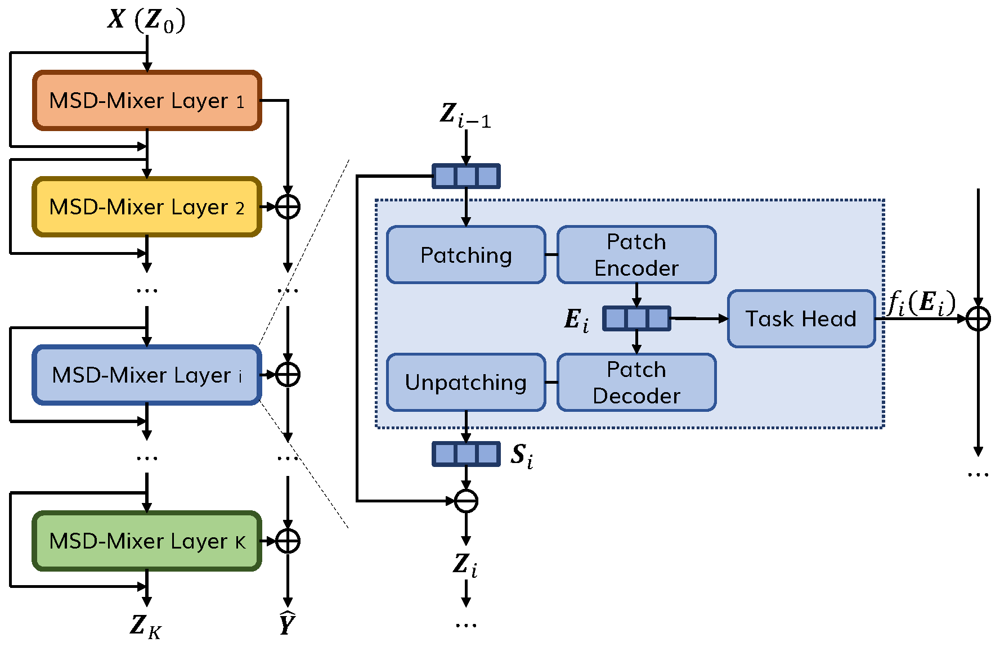
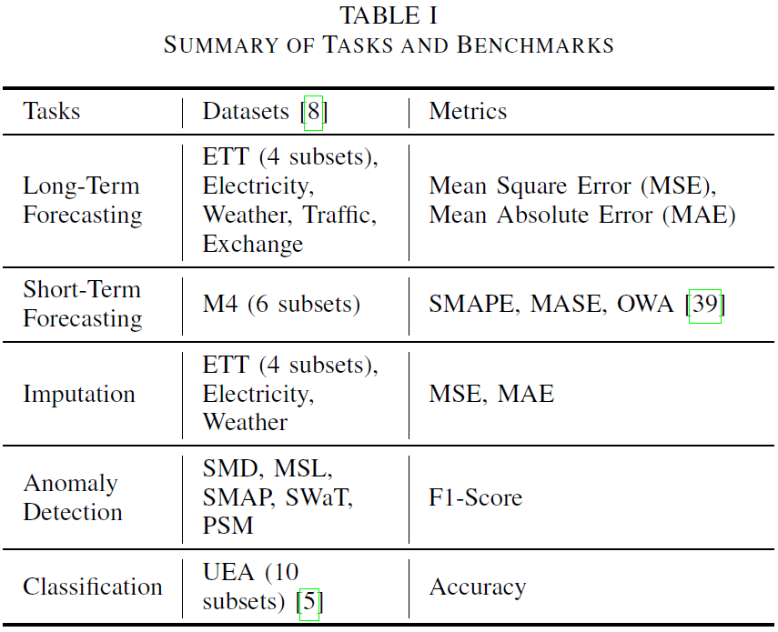

# **MSD-Mixer**: A Multi-Scale Decomposition MLP-Mixer for Time Series Analysis

This is the [PyTorch](https://pytorch.org/) and [Lightning](https://lightning.ai/) implementation of our paper: ***A Multi-Scale Decomposition MLP-Mixer for Time Series Analysis***. (https://arxiv.org/abs/2310.11959)

If you find this repo useful, please consider citing our paper:
```
@misc{zhong2023multiscale,
      title={A Multi-Scale Decomposition MLP-Mixer for Time Series Analysis}, 
      author={Shuhan Zhong and Sizhe Song and Guanyao Li and Weipeng Zhuo and Yang Liu and S. -H. Gary Chan},
      year={2023},
      eprint={2310.11959},
      archivePrefix={arXiv},
      primaryClass={cs.LG}
}
```
## Table of Contents

- [Abstract](#abstract)
- [Dependency Setup](#dependency-setup)
- [Dataset Preparation](#dataset-preparation)
- [Run MSD-Mixer](#run-msd-mixer)
- [Baselines](#baselines)
- [Acknoledgements](#acknowledgements)

## Abstract
Time series data, including univariate and multivariate ones, are characterized by unique composition and complex multi-scale temporal variations. They often require special consideration of decomposition and multi-scale modeling to analyze. Existing deep learning methods on this best fit to univariate time series only, and have not sufficiently considered sub-series level modeling and decomposition completeness. To address these challenges, we propose **MSD-Mixer**, a **M**ulti-**S**cale **D**ecomposition MLP-**Mixer**, which learns to explicitly decompose the input time series into different components, and represent the components in different layers. To handle the multi-scale temporal patterns and multivariate dependencies, we propose a novel temporal patching approach to model the time series as multi-scale sub-series (i.e., patches), and employ MLPs to capture intra- and inter-patch variations and channel-wise correlations. In addition, we propose a novel loss function to constrain both the magnitude and autocorrelation of the decomposition residual for better decomposition completeness. Through extensive experiments on various real-world datasets for five common time series analysis tasks, we demonstrate that MSD-Mixer consistently and significantly outperforms other state-of-the-art algorithms.



## Dependency Setup

* Create a conda virtual environment
  ```bash
  conda create -n msd-mixer python=3.10
  conda activate msd-mixer
  ```
* Install Python Packages
  ```bash
  pip install -r requirements.txt
  ```

## Dataset Preparation



Please download the datasets from [dataset.zip](https://hkustconnect-my.sharepoint.com/:u:/g/personal/szhongaj_connect_ust_hk/EYHKJ1krsyNLi2JAK8xtHKcBjAOwti7clrKzjWTU2U5HDw), unzip the content into the `dataset` folder and structure the directory as follows:
```
/path/to/MSD-Mixer/dataset/
  electricity/
  ETT-small/
  exchange_rate/
  m4/
  MSL/
  Multivariate_ts/
  PSM/
  SMAP/
  SMD/
  SWaT/
  traffic/
  weather/
```

## Run MSD-Mixer

Please use `python main.py` to run the experiments. Please use the `-h` or `--help` argument for details.

### Long-Term Forecasting

Example training commands:
* Run all benchmarks
    ```bash
    python main.py ltf

    # equivalent
    python main.py ltf --dataset all --pred_len all
    ```
* Run specific benchmarks
    ```bash
    python main.py ltf --dataset etth1 etth2 --pred_len 96 192 336
    ```
Logs, results, and model checkpoints will be saved in `/path/to/MSD-Mixer/logs/ltf`

### Short-Term Forecasting

Example training commands:
* Run all benchmarks
    ```bash
    python main.py stf

    # equivalent
    python main.py stf --dataset all
    ```
* Run specific benchmarks
    ```bash
    python main.py stf --dataset yearly quarterly monthly
    ```
Logs, results, and model checkpoints will be saved in `/path/to/MSD-Mixer/logs/stf`

### Imputation

Example training commands:
* Run all benchmarks
    ```bash
    python main.py imp

    # equivalent
    python main.py imp --dataset all --mask_rate all
    ```
* Run specific benchmarks
    ```bash
    python main.py imp --dataset ecl ettm1 --mask_rate 0.25 0.5
    ```
Logs, results, and model checkpoints will be saved in `/path/to/MSD-Mixer/logs/imp`

### Anomaly Detection

Example training commands:
* Run all benchmarks
    ```bash
    python main.py ad

    # equivalent
    python main.py ad --dataset all
    ```
* Run specific benchmarks
    ```bash
    python main.py ad --dataset smd msl swat
    ```
Logs, results, and model checkpoints will be saved in `/path/to/MSD-Mixer/logs/ad`

### Classification

Example training commands:
* Run all benchmarks
    ```bash
    python main.py cls

    # equivalent
    python main.py cls --dataset all
    ```
* Run specific benchmarks
    ```bash
    python main.py cls --dataset awr scp1 scp2
    ```
Logs, results, and model checkpoints will be saved in `/path/to/MSD-Mixer/logs/cls`

## Baselines

* For task-general baselines, including `TimesNet`, `PatchTST`, `DLinear`, `LightTS`, `ETSformer`, `FEDformer`, and `NST`, as well as `N-BEATS` and `N-HiTS` for short-term forecasting, and `Anomaly Transformer` for anomaly detection, we follow and reuse the unified implementations from [Time Series Library (TSlib)](https://github.com/thuml/Time-Series-Library).

* For `Scaleformer` for long-term forecasting, we follow the official implementation from the  [Scaleformer paper](https://github.com/BorealisAI/scaleformer).

* For `TARNet`, `DTWD`, `TapNet`, `MiniRocket`, and `TST` for classification, we follow the implementations from the [TARNet paper](https://github.com/ranakroychowdhury/TARNet). And for `FormerTime` for classification, we follow the implementation from the [FormerTime paper](https://github.com/icantnamemyself/FormerTime)

## Acknowledgements

* [Time Series Library (TSlib)](https://github.com/thuml/Time-Series-Library): datasets, experiment settings, and data processing
* [UEA Time Series Classification datasets](https://www.timeseriesclassification.com/): datasets
